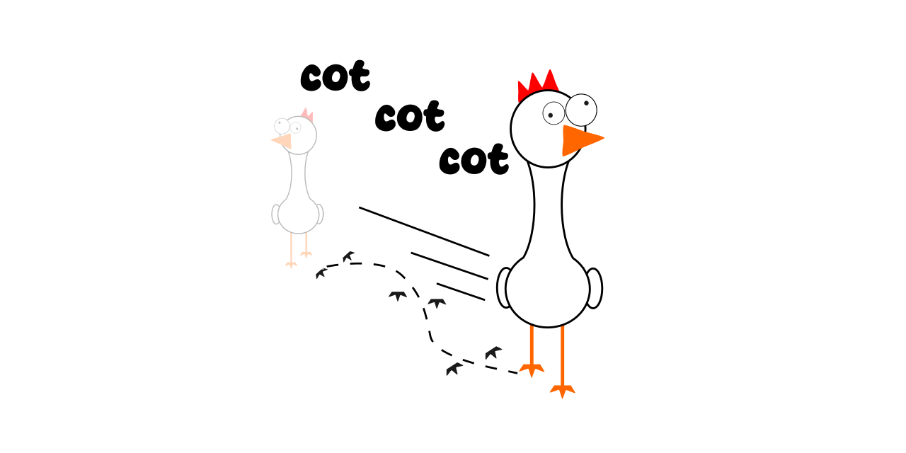
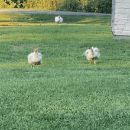
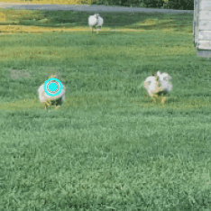
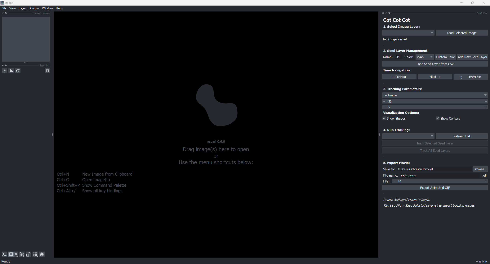
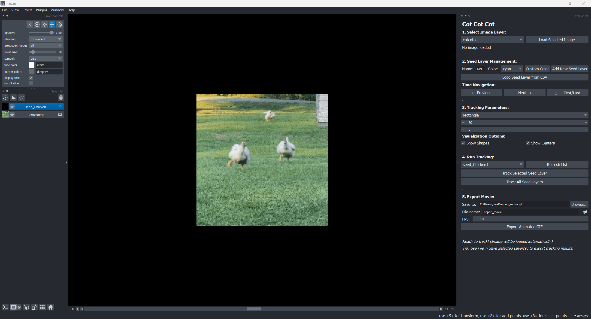
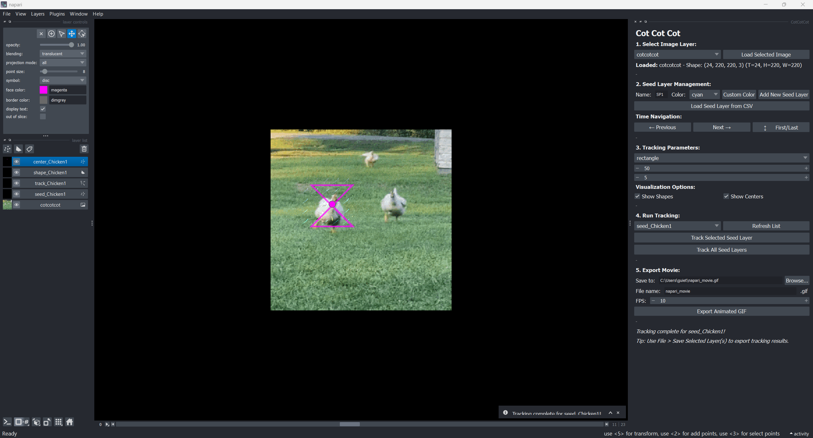
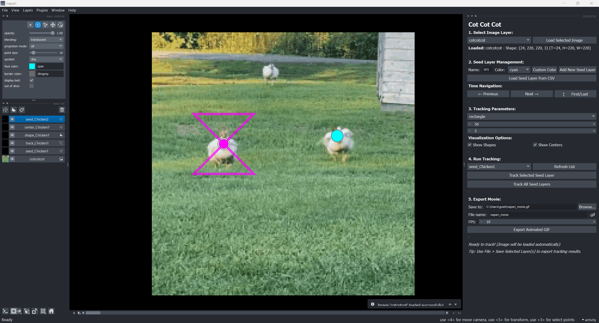
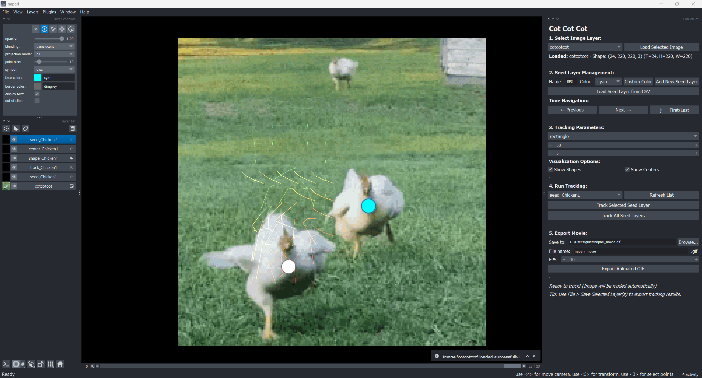
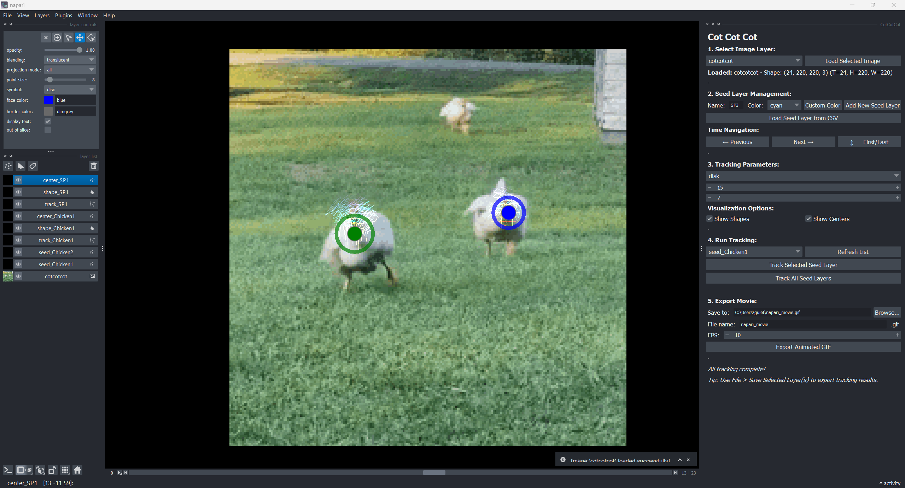

# napari-cotcotcot

[](https://github.com/romainGuiet/napari-cotcotcot/raw/main/LICENSE)
[](https://pypi.org/project/napari-cotcotcot)
[](https://python.org)
[](https://github.com/romainGuiet/napari-cotcotcot/actions)
[](https://codecov.io/gh/romainGuiet/napari-cotcotcot)
[](https://napari-hub.org/plugins/napari-cotcotcot)
[](https://napari.org/stable/plugins/index.html)
[](https://github.com/copier-org/copier)

# napari-cotcotcot



A simple napari plugin to use CoTracker3 for tracking !


| | | 
| --- | --- | 
|  |  | 

## Why naming it cotcotcot ? 

We make use of [CoTracker](https://github.com/facebookresearch/co-tracker), which can be obviously shorten to *cot*, and it's the version 3, therefore **cotcotcot**! 

_Plus, look at this cute chicken above !_

# How to use cotcotcot?

After [installing]() napari-cotcotcot.

Type in your terminal : 
```
naparicot
```

to start napari with the plugin already open



Go to `File > Open Sample > CoTracker sample (cotcotcot)`


To get and an example image to test


Click on the `Track Selected Seed Layer` button to start processing and get new layers!

(_CoTracker3 model should be downlaod the first time, it might take some time, please check your terminal to see progress_) 



One can add one more seed layer


and add seed points (at least 2 , definig start and end of the tracking)


One can also change tracked-shape specifications (reactangle/disk , size, number of points inside)


And use the `Track All Seed Layers` button 

(or select layer to track and use the `Track Selected Seed Layer` button to avoid recomputing the first track)



Finally, one can use the `Export Animated GIF` button, or select a layer of interest and use `File > Save Selected Layers...` to export coordinates of the center of the tracked-shape.

## How to install cotcotcot ? 

### Using pixi

We recommend using [pixi](https://pixi.sh/latest/) ( _but similar python environment should be buildable using conda_)

#### Create a pixi folder
```
pixi init cotcotcot
cd cotcotcot
```
#### Modify toml file

Using a text editor replace the content of the `pixi.toml` file with 

```
[workspace]
authors = ["romainGuiet <romain.guiet@epfl.ch>"]
channels = ["conda-forge"]
name = "cotcotcot"
platforms = ["win-64"]
version = "0.1.0"

[system-requirements]
cuda = "12.0"

[dependencies]
pytorch-gpu = "*"
napari = "*"
pyqt = "*"
tifffile = "*"

[pypi-dependencies]
cotracker = { git = "https://github.com/facebookresearch/co-tracker.git"}
napari-cotcotcot = { git = "https://github.com/BIOP/napari-cotcotcot.git"}
```
then proceed with the installation using 

```
pixi install
```
You're done! 

### SOON ? : 

You can install `napari-cotcotcot` via [pip]:

```
pip install napari-cotcotcot
```

If napari is not already installed, you can install `napari-cotcotcot` with napari and Qt via:

```
pip install "napari-cotcotcot[all]"
```


## Contributing

Contributions are very welcome. Tests can be run with [tox], please ensure
the coverage at least stays the same before you submit a pull request.

## License

Distributed under the terms of the [BSD-3] license,
"napari-cotcotcot" is free and open source software

## Issues

If you encounter any problems, please [file an issue] along with a detailed description.

----------------------------------

This [napari] plugin was generated with [copier] using the [napari-plugin-template] 


[napari]: https://github.com/napari/napari
[copier]: https://copier.readthedocs.io/en/stable/
[@napari]: https://github.com/napari
[MIT]: http://opensource.org/licenses/MIT
[BSD-3]: http://opensource.org/licenses/BSD-3-Clause
[GNU GPL v3.0]: http://www.gnu.org/licenses/gpl-3.0.txt
[GNU LGPL v3.0]: http://www.gnu.org/licenses/lgpl-3.0.txt
[Apache Software License 2.0]: http://www.apache.org/licenses/LICENSE-2.0
[Mozilla Public License 2.0]: https://www.mozilla.org/media/MPL/2.0/index.txt
[napari-plugin-template]: https://github.com/napari/napari-plugin-template

[napari]: https://github.com/napari/napari
[tox]: https://tox.readthedocs.io/en/latest/
[pip]: https://pypi.org/project/pip/
[PyPI]: https://pypi.org/
